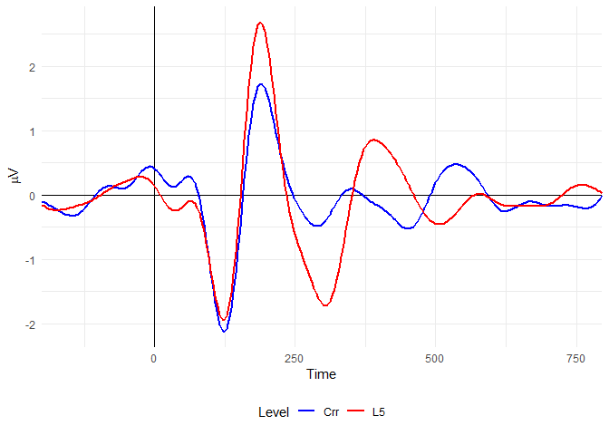
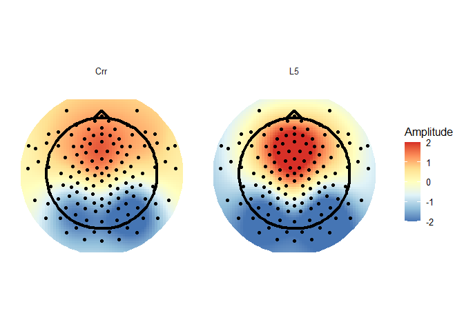
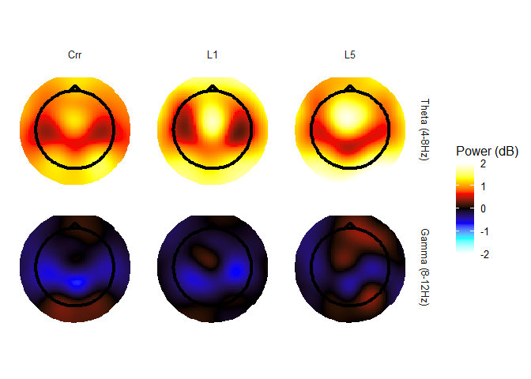

<!-- README.md is generated from README.Rmd. Please edit that file -->

# EPP-TB: The ERP Post-Processing Tool Box 

Once completing pre-processing in eeglab/erplab/Net Station, you’re
ready to get to the fun stuff: plotting and measuring with EPP-TB! This
package is aimed at simple (readable), concise (one function per action)
and reproducible code writing. Additionally, a major component is the
ability to export data and plots to be used and further manipulated
elsewhere (say, `ggplot2`?).

All user-end functions start with `epp_*`.

## Getting Started

### Prerequisites

To use EPP-TB you will need:

-   Matlab (2015a+).
-   [eeglab](https://sccn.ucsd.edu/eeglab/index.php) (14.X.X) for
    importing `.set` files, and plotting topos.
-   R (for plotting in R)
    -   [`tidyverse`](https://github.com/tidyverse/tidyverse) +
        [`purrr`](https://github.com/tidyverse/purrr).
    -   [`scales`](https://github.com/hadley/scales) for plotting in R.
    -   [`mgcv`](https://cran.r-project.org/package=mgcv) for plotting
        topo plots.

### Installing

You can install the package by
[downloading](https://github.com/mattansb/EPP-TB/releases) and adding
the EPP-TB folder (and sub-folders) to your Matlab paths.

## Importing Data into an EPP structure

Three import methods are currently supported:

-   `epp_loadeeglab` - Import multiple `.set` files from eeglab
    (supports wavelet analysis based on [Mike X. Cohen’s great book and
    code](http://www.mikexcohen.com/)).
-   `epp_loaderplab` - Import from
    [erplab](http://www.erpinfo.org/erplab.html).
-   `epp_loadegimat` - Import multiple `.mat` files exported from Net
    Station (EGI).

The resulting structure array has `length(struct)` equal to the number
of conditions, and contains the following fields, per condition:

-   **Condition**: the name of the conditions.
-   **timeLine**: a vector of time points.
-   **IDs**: a table with two variables - ***ID*** and ***nTrials***
    (the number of trials a ERP has been averaged across).
-   **Data**: a `channels` *x* `time points` *x* `Subjects` matrix for
    ERP data.

If a wavelet analysis has been preformed, the Data field is replaced
with:

-   **ersp** and **itc**: `channels` *x* `frequencies` *x* `time points`
    *x* `Subjects` matrices.

-   **Freqs**: a vector of frequencies used.

### Data Reduction / Reshaping

These functions can be used to compute new conditions or manipulate
existing data:

-   Merge 2 or more conditions with `epp_combineconds()`.
-   Compute differences between 2 conditions with `epp_diffwave()`.
-   Compute LRP with `epp_LRP()`
-   Compute global field potentials with `epp_GFP()`.
-   Collapse TF data to frequency waveforms with `epp_reshapeTF()`.
-   Make grand-average ERP/ERSP/ITC with `epp_makegrands()` (useful for
    plotting large data sets).

### Working with ID data

-   Add data to `study.IDs` from a table with `epp_appendID()`.
-   Retain subjects that have data in all specified conditions with
    `epp_matchsubjects()`.
-   Select data from specific subjects by some variable in `study.IDs`
    with `epp_filter_by()`.
-   Pull data from `study.IDs` with `epp_extractIDs()`.

## Plotting

> For all `epp_plot*` functions, which allow plotting data from `epp`
> structures, there is an accompanying general `p_*` function, that
> allows plotting from other data structures (with a little bit of
> wrangling).

### ERP Plots

#### Grand averages

Grand averages can be plotted by specifying the conditions and channel
indices (averaged across) to plot:

``` matlab
conds         = {'Crr','L5'};
channel_inds  = [5 6 11 12];
epp_plotgrands(study,conds,channel_inds)
```

<!-- -->

You can also plot error envelopes:

``` matlab
epp_plotgrands(study,conds,channel_inds,'errorType','SE')
% can also be set to 'SD' or 'CIXX' 
% (with XX replaced with any percent: 'CI95','CI80', etc...).
```

<!-- -->

#### Topo Plots

Topo plotting is dependent on eeglab functions. Additionally, you will
need to provide a eeglab-like chanlocs structure to these functions,
with `length(chanlocs)==size(study.Data,1)`.

``` matlab
times = [185];
epp_plottopo(study,chanlocs,conds,channel_inds,times)
```

<!-- -->

#### Butterfly and Trace Plots

Butterfly plots can be used to plot the mean ERP for each subject
individually.

``` matlab
epp_plotbutterfly(study,conds,channel_inds)
```

<!-- -->

Trace plots are similar to butterfly plots, but the mean activation
(across subjects) is plotted for each channel separately.

``` matlab
channel_inds = []; % if left blank, all channels are plotted.
epp_plotbutterfly(study,conds,channel_inds,'trace',true)
```

<!-- -->

#### Channel Plots

Similar to trace plots, channel plots give a picture of what is
happening at each channel (like `eeglab`’s `plottopo`). These come in
two flavors:

-   Topo Plots - channel data is plotted in 2-d space, like a
    topo-plot.  
-   Grid Plots - channel data is plotted on a simple grid.

Channel topo plots are created with the following Matlab call:

``` matlab
channel_inds = []; % if left blank, all channels are plotted.
epp_plotchannels(study,conds,electrodes,'chanlocs',chanlocs)
```

Grid plots are called using the same call, without providing `chanlocs`.

### TF Plots

#### Time-Frequency Plot

Time Frequency plots plot both ersp and itc:

``` matlab
epp_plotTF(study,conds,channel_inds)
```

<!-- -->

#### Other Plots

All the listed above plotting methods also support TF data. For example:

``` matlab
times = [160 410];
bands = [4 8; 8 12];
% a matrix of frequencies, with each row containing a range of frequencies
% to plot (1st column is lower limit, 2nd column is upper limit of band).
epp_plottopo(study,chanlocs,conds,channel_inds,times,...
    'freqs',bands, 'type', 'ersp')
```

<!-- -->

### Exporting to R

All plots can be exported to R and plotted with
[`ggplot2`](https://github.com/tidyverse/ggplot2) by setting `'R',true`
in any of the plotting function (this is how the plots in this README
were made). This produces two time-stamped files:

-   A data file (`*_data.csv`)
-   A code file (`*_code.R`), to plot said data using `ggplot2`.

## Measuring

Measuring can be done via the `epp_get*` functions. These are wrapper
functions for the various `m_*` functions (with one functions per
method), **which should not be called directly** (unless you know what
you’re doing).

Saving results always produces a 2-sheet `.xlsx` file, with the second
sheet containing the parameters used in measuring - this is to insure
reproducibility of results. Thus, if you have the output `.xlsx` file,
you’ll never find yourself asking “what was the time window we used last
time?”.

### ERP Amplitude

The function `epp_getAmp` implements the methods for measuring
amplitudes described in chapter 9 of [Steven J. Luck’s intro to ERP
book](https://mitpress.mit.edu/books/introduction-event-related-potential-technique-0).

-   (Local) Peak amplitude
-   Point amplitude
-   Mean amplitude
-   Integral
-   Area

### ERP Latency

The function `epp_getLat` implements the methods for measuring latencies
described in chapter 9 of [Steven J. Luck’s intro to ERP
book](https://mitpress.mit.edu/books/introduction-event-related-potential-technique-0),
as well as those described in [Kiesel et al.’s Jakknife
paper](http://onlinelibrary.wiley.com/doi/10.1111/j.1469-8986.2007.00618.x/abstract).

-   (Local) Peak latency
-   Relative criterion
-   Fractional area
-   Baseline deviation
-   Absolute criterion

### TF Power

The function `epp_getTF` measure the *mean* ersp / itc from selected
channels, within a specified time-window,separately for specified
frequency bands (as shown above, for `epp_plottopoTF`).

## Authors

-   **Mattan S. Ben-Shachar** \[aut, cre\].
-   **Rachel Rac** \[ctb\].
-   **Michael Shmueli** \[ctb\].

## Acknowledgments

-   **Mike X. Cohen** - who’s
    [code](http://mikexcohen.com/lectures.html) was implemented in
    [`f_WaveletConv.m`](https://github.com/mattansb/EPP-TB/blob/master/supportfuncs/f_WaveletConv.m).
-   **Matt Craddock** - who’s
    [code](https://craddm.github.io/blog/2017/02/25/EEG-topography) was
    implemented in
    [`epp_plottopo.R`](https://github.com/mattansb/EPP-TB/blob/master/plot/epp_plottopo.R).
-   **Winston Chang** - who’s
    [code](http://www.cookbook-r.com/Graphs/Plotting_means_and_error_bars_(ggplot2)/)
    for computing within-subject (and mixed model) CI’s was implemented
    in
    [`epp_plotgrands.m`](https://github.com/mattansb/EPP-TB/blob/master/plot/epp_plotgrands.m).
